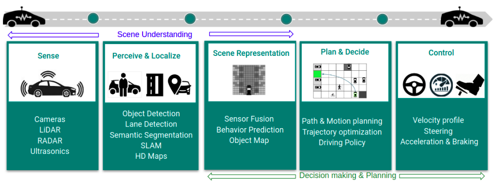

# Deep Learning for Self-Driving Cars

## Components of Self-Driving System

The Autonomous Driving survey paper (https://arxiv.org/pdf/2002.00444.pdf) demonstrates the above pipeline from sensor stream to control actuation.

The **sensor architecture** includes multiple sets of cameras, radars and LIDARs as well as a GPS-GNSS system for absolute localization and Inertial Measurement Units (IMUs) that provide 3D pose of the vehicle in space.

The goal of the **perception module** is the creation of an intermediate level representation of the environment state that is be later utilized by a decision making system that produces the driving policy.

This state would include lane position, drivable zone, location of agents such as cars, pedestrians, state of traffic lights and others.

Several perception tasks like _semantic segmentation_, _motion estimation_, _depth estimation_, _soiling detection_, etc which can be unified into a multi-task model.

## Deep Learning Basics

- [Offical PyTorch tutorials](http://pytorch.org/tutorials/) for more tutorials (some of these tutorials are included there)
- [apachecn/MachineLearning](https://github.com/apachecn/MachineLearning)
einforcement Learning Algorithms. Python, OpenAI Gym, Tensorflow](https://github.com/dennybritz/reinforcement-learning)
- [lawlite19/DeepLearning_Python](https://github.com/lawlite19/DeepLearning_Python)
- [A collection of tutorials and examples for solving and understanding machine learning and pattern classification tasks](https://github.com/rasbt/pattern_classification)
- [Deep Learning papers reading roadmap for anyone who are eager to learn this amazing tech](https://github.com/songrotek/Deep-Learning-Papers-Reading-Roadmap)
- [Content for Udacity's Machine Learning curriculum](https://github.com/udacity/machine-learning)
- [This is the lab repository of my honours degree project on machine learning](https://github.com/ShokuninSan/machine-learning)
- [A curated list of awesome Machine Learning frameworks, libraries and software](https://github.com/josephmisiti/awesome-machine-learning)
- [Bare bones Python implementations of some of the fundamental Machine Learning models and algorithms](https://github.com/eriklindernoren/ML-From-Scratch)
- [The "Python Machine Learning" book code repository and info resource](https://github.com/rasbt/python-machine-learning-book)

--- 
## Table of Contents

#### P1 - Detecting Lane Lines
 - **Basic:** Detected highway lane lines on a video stream. Used OpencV image analysis techniques to identify lines, including Hough Transforms and Canny edge detection.
 - **Advanced:** Built an advanced lane-finding algorithm using distortion correction, image rectification, color transforms, and gradient thresholding. Identified lane curvature and vehicle displacement. Overcame environmental challenges such as shadows and pavement changes.
 - **Keywords:** Computer Vision, OpenCV
 
#### P2 - Traffic Sign Classification
 - **Summary:** Built and trained a deep neural network to classify traffic signs, using TensorFlow. Experimented with different network architectures. Performed image pre-processing and validation to guard against overfitting.
 - **Keywords:** Computer Vision, Deep Learning
 
#### P3 - Behavioral Cloning
 - **Summary:** Built and trained a convolutional neural network for end-to-end driving in a simulator, using TensorFlow and Keras. Used optimization techniques such as regularization and dropout to generalize the network for driving on multiple tracks.
 - **Keywords:** Deep Learning, Convolutional Neural Networks

#### P4 - Vehicle Detection and Tracking
 - **Summary:** Created a vehicle detection and tracking pipeline with OpenCV, histogram of oriented gradients (HOG), and support vector machines (SVM). Implemented the same pipeline using a deep network to perform detection. Optimized and evaluated the model on video data from a automotive camera taken during highway driving.
 - **Keywords:** Computer Vision, Deep Learning, OpenCV

#### P5 - Road Segmentation
- **Summary:** Implement the road segmentation using a fully-convolutional network.
- **Keywords:** Deep Learning, Semantic Segmentation

#### P6 - Extended Kalman Filter
 - **Summary:** Implement the extended Kalman filter in C++. Simulated lidar and radar measurements are used to detect a bicycle that travels around your vehicle. Kalman filter, lidar measurements and radar measurements are used to track the bicycle's position and velocity.
 - **Keywords:** C++, Kalman Filter

#### P7 - Unscented Kalman Filter
 - **Summary:**  Utilize an Unscented Kalman Filter to estimate the state of a moving object of interest with noisy lidar and radar measurements. Kalman filter, lidar measurements and radar measurements are used to track the bicycle's position and velocity.
 - **Keywords:** C++, Kalman Filter
 
#### P8 - Kidnapped Vehicle
 - **Summary:** Your robot has been kidnapped and transported to a new location! Luckily it has a map of this location, a (noisy) GPS estimate of its initial location, and lots of (noisy) sensor and control data. In this project you will implement a 2 dimensional particle filter in C++. Your particle filter will be given a map and some initial localization information (analogous to what a GPS would provide). At each time step your filter will also get observation and control data.
 - **Keywords:** C++, Particle Filter
 
#### P9 - PID Control
 - **Summary:** Implement a PID controller for keeping the car on track by appropriately adjusting the steering angle.
 - **Keywords:** C++, PID Controller
 
#### P10 - MPC Control
- **Summary:** Implement an MPC controller for keeping the car on track by appropriately adjusting the steering angle. Differently from previously implemented PID controller, MPC controller has the ability to anticipate future events and can take control actions accordingly. Indeed, future time steps are taking into account while optimizing current time slot.
- **Keywords:** C++, MPC Controller

#### P11 - Path Planning
- **Summary:** The goal in this project is to build a path planner that is able to create smooth, safe trajectories for the car to follow. The highway track has other vehicles, all going different speeds, but approximately obeying the 50 MPH speed limit. The car transmits its location, along with its sensor fusion data, which estimates the location of all the vehicles on the same side of the road.
- **Keywords:** C++, Path Planning

## References

- <https://github.com/ndrplz/self-driving-car>
