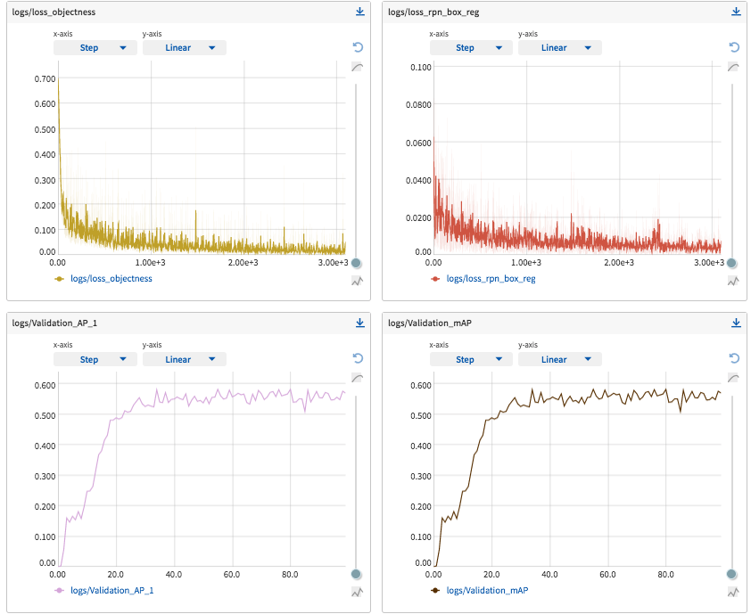

# Train your own object detector with Faster-RCNN & PyTorch

This repository contains all files that were used for the blog tutorial
[**Train your own object detector with Faster-RCNN & PyTorch**](https://github.com/ifding/faster-rcnn-tutorial).

- If you want to use neptune for your own experiments, add the 'NEPTUNE' env var to your system. For example, I use `dotenv`:

`$ dotenv set NEPTUNE your_key`

It will create `.env` in current dir, and `.env` is already added in the `.gitignore`. After that, when you put `load_dotenv()` in your code, it will automatically take the 'NEPTUNE' env var from `.env`.

- Just focus on modifying `custom_dataset.py` file for your own data
- Now compatible with pytorch 1.9 and pytorch lighting 1.37

## Installation steps:

- `conda create -n <env_name>`
- `conda activate <env_name>`
- `conda install python=3.8` 
- `git clone https://github.com/ifding/faster-rcnn-tutorial.git`
- `cd faster-rcnn-tutorial`
- `pip install .`
- You have to install a pytorch version with `pip` or `conda` that meets the requirements of your hardware. 
  Otherwise the versions for torch etc. specified in [setup.py](setup.py) are installed.
  To install the correct pytorch version for your hardware, check [pytorch.org](https://pytorch.org/).
- [OPTIONAL] To check whether pytorch uses the nvidia gpu, check if `torch.cuda.is_available()` returns `True` in a python shell.

## Custom dataset: balloon

- `sh download_dataset.sh`
- `CUDA_VISIBLE_DEVICES=0 python train.py`
- check the checkpoint in folder `balloon` and experiment details in <https://app.neptune.ai/>

## Acknowledge

Most code is borrowed from <https://github.com/johschmidt42/PyTorch-Object-Detection-Faster-RCNN-Tutorial>, thanks, Johannes Schmidt!

I try to reduce less important compontents, and make the whole pipeline more clear.
